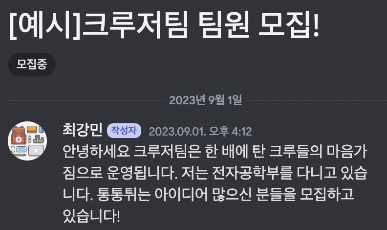

# 경북대 IT 프로젝트 교육 idea2innovation

## 해커톤 역량강화해보자!

반갑습니다 {{ NAME }}님 IT 프로젝트를 진행할 준비가 되셨나요?

이새롬 교수님과 함께 Idea2Innovation 프로그램을 진행하게 된 해달프로그래밍 최강민입니다. IT프로젝트를 진행해서 해커톤에서 이름 날릴 여러분들의 능력을 키우는 방법을 알려드리려 합니다.

이번 수업의 목표는 창업경진대회나 해커톤에 나가실 수 있는 수준까지 도와드리려 합니다. 팀빌딩, 스마트워크시스템, 스프린트 등 해커톤부터 창업동아리/스타트업 협업까지 필요한 요소들을 알려드리겠습니다.

찬찬히 따라오시면 됩니다 :)

## 목표

1. 1개월 간의 프로젝트 수행 후, 희망자에 한하여 해커그라운드 해커톤 2024에 출전할 예정입니다.
   - [작년도 해커그라운드 해커톤 기사](https://www.imaeil.com/page/view/2023070314324916579)
   - [해커톤 스케치 영상](https://youtu.be/vGnvoaQd7dA?si=XgyOkrSgLaF6A6O9)

2. 정보시스템 학회 Session 2 "모두의 창업"에 참가합니다.

## Step 1 디스코드 참여

프로그램을 진행하며 디스코드를 통해 공지 및 안내가 나갈 예정입니다. 아래 디스코드를 참여해주세요!

- [디스코드 참여하기](https://discord.gg/suSrqqMefb)

## Step 2 팀 빌딩

팀빌딩부터 시작하고자 합니다.

[디스코드](https://discord.gg/suSrqqMefb) “자유팀빌딩” 채널에서 글을 작성합니다. 

1. 팀이 있는 경우
    - 협의된 팀원들과 아래 이미지와 같이 작성합니다.
2. 팀이 없는 경우
    - 리더를 하고 싶은 분은 아이디어 혹은 팀문화를 소개
    - 팔로워를 하실 분들은 적극적으로 자기PR을 진행합니다.

